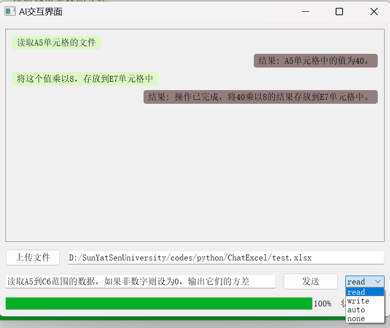

# Introduction
Excel operations through user natural language input. This project can update or read Excel files based on user input

# Notice
- The current language used in the project is Chinese (I originally intended to use English, but unfortunately my English proficiency is not good. This README.md file is written in English to enhance my English writing skills)
- Python version: At least 3.7. Pip version: Latest stable version (strongly recommended), but at least 10.00
- This project can currently only run on Microsoft Windows systems and has not yet been adapted to Linux and macOS systems
- This AI can read and analyze the contents of a certain range of cells, and can also store data in specified cells
- AI generated text does not represent the author's viewpoint

# Preview





# Quick Start
1. download python from <http://www.python.org/download/>, you can use command:
    ``` powershell
    python --version && pip --version
    ```
    to check if you have successfully installed python and pip.

2. download this project by using command:
    ``` bash
    git clone https://github.com/math-zhuxy/ChatExcel.git
    ```
3. use command:
    ``` powershell
    pip install -r requirements.txt
    ```
    to install all packages required for this project.

4. Go to the chat glm official website <https://www.bigmodel.cn> to obtain the chat glm API key

5. Create a file named 'config. json' in the root directory of the project. The JSON template can be referenced from the 'confic_template. json' file

6. now you can run this project, use command:
    ``` powershell
    python main.py
    ```
# Test project
you can use command:
``` powershell
pytest -s
```
to test all functions or class names starting with 'test', the project already has templates for testing functions

# How to use it
1. You can first click the upload file button in the bottom left corner and select the Excel file you want to operate on in the pop-up file explorer. If you have not uploaded the file or your input box is empty, the system will display a warning pop-up

2. You can select the mode you require in the bottom right corner. There are four modes in total: 
    - read mode: GLM only calls read functions
    - write mode: GLM only calls write functions
    - automatic mode: GLM chooses which function to call
    - disable mode: GLM is prohibited from calling functions
3. Next, you can enter your request in the text box, and then click the "Send" button to send your request

4. AI will understand your actions and perform corresponding operations. You can see the progress of AI operations on the progress bar below. After completing your operation, there will be a prompt at the top of the page

5. You can open the excel file to check if GLM is operating correctly